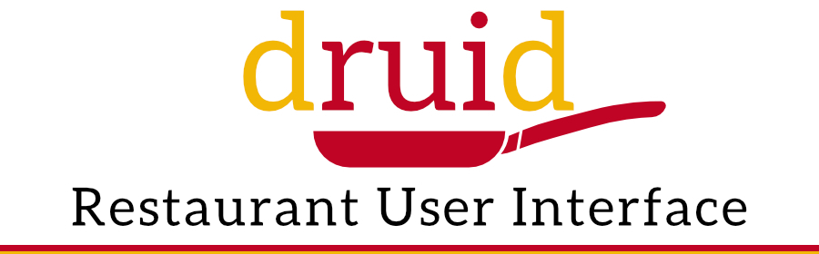
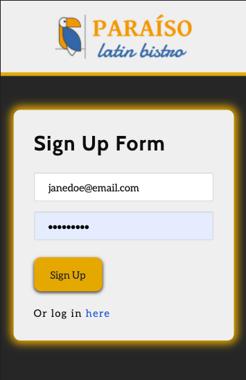

<h1 align="center">DruiD Restaurant Interface</h1>

  <a>
    </>
    <a>

 

  <a>
    </>
  <a>
  <a>
  </>
  <a>
  

<a>
  
  <a> 

	The motivation for creating this full-stack application was in hopes of digitalizing a restaurant's menu to expedite the input of the menu's as well as changing particular items a restaurant serves with a click. We created a website for a Purivian restaurant named Paraiso's. Eddie & Kenny utilized MySql for the storage of our databases in which consisted of menu items that are organized individually by section, item description, and price. The information that outputs is all stored in the Schema & Seeds databases that our team developed. We created the foundation for our table using the Schema, which gave a place for our menu items using GET & POST routes.  Jeuel implemented a new library he discovered named shoe-laces & utilized a grid system for the layout of our website. The presence of shoe-laces allowed for an organized finish to the website's blueprints. 

	Our team collaborated & worked together on generating HTML using handlebars, and CSS documents to populate the welcome screen, view menu section, and the restaurant command center. The CSS applied on all the pages created the slide-show background, vibrant color scheme, and appropriate spacing. The implication of handlebars helped simplify the tasks of manually updating data, and kept our HTML pages clean while separating logic-less templates from the business logic in our Javascript files. These changes improved the overall performance & stability of the Paraiso's webpage.

<a>
  </>
  <a> 

**[Installation](.Installation)** 
**[Usage](.Usage)** 
**[License](.License)** 
**[Contributors](.Contributors)** 
**[Tests](.Tests)** 
**[Contact](.Contact)** 

 <a align="left" margin="35px" class="Installation">
<a>
  </>
  <a> 

1. npm install

1. node server.js (runs application on local computer.) 

<a align="left" margin="auto" class="Usage">
<a>
  </>
  <a>  

 This application's purpose is to serve as a restaurant management device. The consumer will be able to utilize viewing the menu digitally. The owner of the restaurant will be able to sign-up to add & remove items from the menu. The website was designed adequately with mobile-friendliness in mind. 

 

  <a>
    </>
    <a>

 

<a align="left" margin="auto" class="License">
<a>
  </>
  <a>  

* mit

<a align="left" margin="auto" class="Contributors">
<a>
  </>
  <a> 

* Jeuel Viveros (vjeuel)

* Kulpreet Singh (ksingh-1)

* Eddie Sevilla (esevilla93). 

<a align="left" margin="auto" class="Tests">
<a>
  </>
  <a> 
   
N/A

<a align="left" margin="auto" class="Contact">
<a>
  </>
  <a>  

* k_deari@yahoo.com

* vjeuel@gmail.com

* kulpreet.s18@gmail.com

* esevilla93@gmail.com
 

